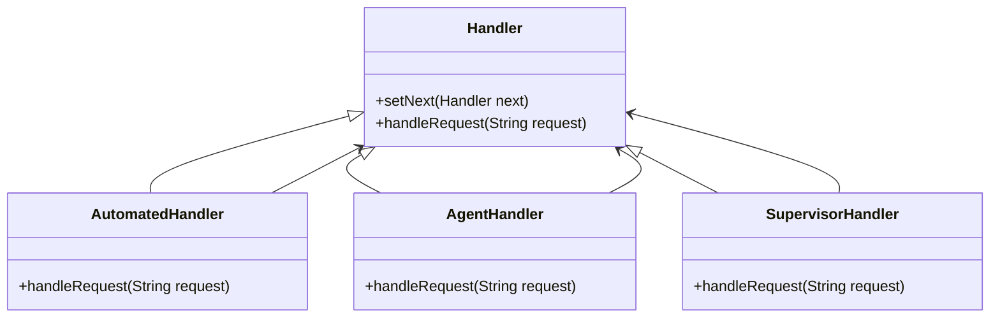

# Chain of Responsibility Pattern

This pattern is useful when you want to decouple the sender of a request from its receiver, allowing multiple handlers to process the request independently.
Allows an object to pass a request along a chain of potential handlers until one of them processes it. 

# Key Concepts:
    - **Handler Interface:** Defines a method for handling requests and allows setting the next handler in the chain.
    - **Concrete Handlers:** Implement the handler interface and either process the request or forward it to the next handler.
    - **Client:** Initiates the request and does not need to know how it will be handled.

# Problem
Imagine a customer support system where users can submit issues that vary in complexity. Some issues can be resolved by a simple automated response, while others may require human intervention at different levels (e.g., agent, supervisor, manager). How do you design a system that dynamically routes these issues to the appropriate handler without hardcoding the logic?

# Solution
Using the Chain of Responsibility pattern, you can create a chain of handlers where each handler decides whether it can process the request. If not, it forwards the request to the next handler in the chain.

**Handler Interface**

```java
public abstract class Handler {
    protected Handler next;

    public void setNext(Handler next) {
        this.next = next;
    }

    public abstract void handleRequest(String request);
}
```
**Concrete Handlers**

```java
public class AutomatedHandler extends Handler {
    public void handleRequest(String request) {
        if (request.equals("basic")) {
            System.out.println("AutomatedHandler: Resolving basic request.");
        } else if (next != null) {
            next.handleRequest(request);
        } else {
            System.out.println("AutomatedHandler: Unable to process the request.");
        }
    }
}

public class AgentHandler extends Handler {
    public void handleRequest(String request) {
        if (request.equals("intermediate")) {
            System.out.println("AgentHandler: Resolving intermediate request.");
        } else if (next != null) {
            next.handleRequest(request);
        } else {
            System.out.println("AgentHandler: Unable to process the request.");
        }
    }
}

public class SupervisorHandler extends Handler {
    public void handleRequest(String request) {
        if (request.equals("complex")) {
            System.out.println("SupervisorHandler: Resolving complex request.");
        } else if (next != null) {
            next.handleRequest(request);
        } else {
            System.out.println("SupervisorHandler: Unable to process the request.");
        }
    }
}
```
**Client Code**

```java
public class Client {
    public static void main(String[] args) {
        // Create handlers
        Handler automatedHandler = new AutomatedHandler();
        Handler agentHandler = new AgentHandler();
        Handler supervisorHandler = new SupervisorHandler();

        // Set up the chain
        automatedHandler.setNext(agentHandler);
        agentHandler.setNext(supervisorHandler);

        // Process requests
        System.out.println("Handling 'basic' request:");
        automatedHandler.handleRequest("basic");

        System.out.println("\nHandling 'intermediate' request:");
        automatedHandler.handleRequest("intermediate");

        System.out.println("\nHandling 'complex' request:");
        automatedHandler.handleRequest("complex");

        System.out.println("\nHandling 'unknown' request:");
        automatedHandler.handleRequest("unknown");
    }
}
```

# Diagram



# FAQ

## Why use the Chain of Responsibility Pattern?
    - Encapsulation of request handling:
    The Chain of Responsibility pattern provides a way to delegate the processing of a request along a chain of handlers, abstracting away the details of which handler actually processes the request.
    - Promotes flexibility:
    It allows the addition or removal of handlers without modifying the client or other handlers, adhering to the open/closed principle.
    - Decouples sender and receiver:
    The client (sender) doesn’t need to know which handler will handle the request, enabling loose coupling between components.

## What are the benefits of using the Chain of Responsibility pattern?
    - **Decouples request handling:**
    The sender and receiver are loosely coupled, as the request is passed along a chain of handlers until one can process it.
    - **Supports the Open/Closed Principle:**
    You can add new handlers to the chain without modifying existing code.
    - **Improves scalability:**
    Handlers can be reused and easily rearranged within the chain to accommodate changing requirements.

## What are the disadvantages of using the Chain of Responsibility pattern?
    - **Uncertain request processing:**
    If no handler in the chain can process the request, it may remain unhandled unless explicitly managed.
    - **Increased complexity:**
    The chain introduces additional objects and logic, which may feel over-engineered for simple scenarios.

## How does the Chain of Responsibility affect SOLID principles?
    - **Single Responsibility Principle (SRP):**
    Each handler is responsible for processing a specific type of request, adhering to SRP.
    - **Open/Closed Principle (OCP):**
    New handlers can be added to the chain without modifying existing handlers or the client code.
    - **Liskov Substitution Principle (LSP):**
    Any subclass of the base handler can be used in the chain without affecting its functionality.
    - **Interface Segregation Principle (ISP):**
    Handlers define a clear interface for processing requests, adhering to ISP.
    - **Dependency Inversion Principle (DIP):**
    High-level modules depend on abstractions (e.g., the handler interface), not concrete implementations.

## How easy is it to test the Chain of Responsibility pattern?
    Testing is straightforward because you can test individual handlers in isolation and verify their interactions within the chain. Mocking the next handler in the chain allows for comprehensive unit tests.

## How can I test the Chain of Responsibility pattern?
    You can mock or stub handlers to verify that requests are passed correctly and handled as expected.

Example:

```java
public class HandlerTest {
    @Test
    public void testSingleHandler() {
        Handler handler = new AutomatedHandler();
        String response = handler.handleRequest("Automated");

        assertEquals("Automated Handler processed the request.", response);
    }

    @Test
    public void testChainOfHandlers() {
        Handler automatedHandler = new AutomatedHandler();
        Handler agentHandler = new AgentHandler();
        Handler supervisorHandler = new SupervisorHandler();

        automatedHandler.setNext(agentHandler);
        agentHandler.setNext(supervisorHandler);

        // Test with a request handled by the automated handler
        String response1 = automatedHandler.handleRequest("Automated");
        assertEquals("Automated Handler processed the request.", response1);

        // Test with a request passed to the agent handler
        String response2 = automatedHandler.handleRequest("Agent");
        assertEquals("Agent Handler processed the request.", response2);

        // Test with a request passed to the supervisor handler
        String response3 = automatedHandler.handleRequest("Supervisor");
        assertEquals("Supervisor Handler processed the request.", response3);
    }

    @Test
    public void testUnhandledRequest() {
        Handler automatedHandler = new AutomatedHandler();

        // No handler in the chain to process this request
        String response = automatedHandler.handleRequest("Unknown");
        assertNull(response);
    }
}
```