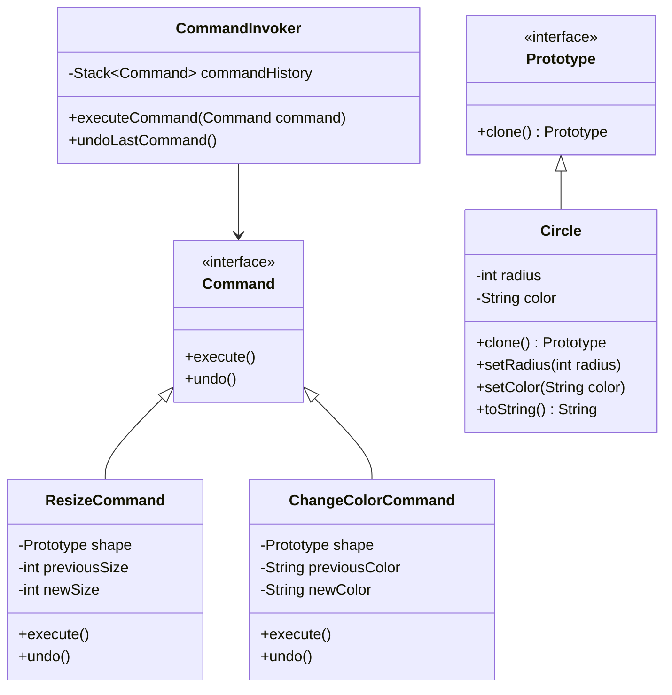

# Command Pattern

The Command Pattern encapsulates a request as an object, thereby allowing users to parameterize objects with different requests, delay or queue requests, and support undoable operations.

# Key Concepts
    - **Command Interface:** Declares an execute method for executing commands.
    - **Concrete Commands:** Implements the execute method and encapsulates the action to perform on a receiver (e.g., shape).
    - **Invoker:** Responsible for executing commands and managing history for undo/redo operations.
    - **Receiver:** The actual object (e.g., Circle, Rectangle) that the command acts upon.

# Implementation

**Command Interface**

```java
public interface Command {
    void execute();
    void undo();
}
```

**ResizeCommand**

```java
public class ResizeCommand implements Command {
    private final Prototype shape;
    private final int previousSize;
    private final int newSize;

    public ResizeCommand(Prototype shape, int newSize) {
        this.shape = shape;
        this.previousSize = ((Circle) shape).getRadius(); // Assuming `Circle` for simplicity
        this.newSize = newSize;
    }

    @Override
    public void execute() {
        ((Circle) shape).setRadius(newSize);
    }

    @Override
    public void undo() {
        ((Circle) shape).setRadius(previousSize);
    }
}
```

**ChangeColorCommand**

```java
public class ChangeColorCommand implements Command {
    private final Prototype shape;
    private final String previousColor;
    private final String newColor;

    public ChangeColorCommand(Prototype shape, String newColor) {
        this.shape = shape;
        this.previousColor = ((Circle) shape).getColor(); // Assuming `Circle` for simplicity
        this.newColor = newColor;
    }

    @Override
    public void execute() {
        ((Circle) shape).setColor(newColor);
    }

    @Override
    public void undo() {
        ((Circle) shape).setColor(previousColor);
    }
}
```

**Invoker**

```java
import java.util.Stack;

public class CommandInvoker {
    private final Stack<Command> commandHistory = new Stack<>();

    public void executeCommand(Command command) {
        command.execute();
        commandHistory.push(command);
    }

    public void undoLastCommand() {
        if (!commandHistory.isEmpty()) {
            Command lastCommand = commandHistory.pop();
            lastCommand.undo();
        }
    }
}
```

## Receiver (Prototype Objects)
The Circle and Rectangle classes remain unchanged from the Prototype Pattern, serving as the receivers.

## Client Code

```java
public class CommandPatternDemo {
    public static void main(String[] args) {
        // Create a shape using Prototype
        Circle originalCircle = new Circle(10, "Red");
        System.out.println("Original: " + originalCircle);

        // Clone the shape
        Circle clonedCircle = (Circle) originalCircle.clone();
        System.out.println("Cloned: " + clonedCircle);

        // Create an invoker
        CommandInvoker invoker = new CommandInvoker();

        // Execute commands on the cloned shape
        Command resizeCommand = new ResizeCommand(clonedCircle, 15);
        Command changeColorCommand = new ChangeColorCommand(clonedCircle, "Blue");

        invoker.executeCommand(resizeCommand);
        System.out.println("After Resize: " + clonedCircle);

        invoker.executeCommand(changeColorCommand);
        System.out.println("After Color Change: " + clonedCircle);

        // Undo last command
        invoker.undoLastCommand();
        System.out.println("After Undo Color Change: " + clonedCircle);

        // Undo resize
        invoker.undoLastCommand();
        System.out.println("After Undo Resize: " + clonedCircle);
    }
}
```

# Diagram


# FAQ

## How does the Command Pattern integrate with the Prototype Pattern?

The Prototype Pattern provides cloned instances of objects (shapes), while the Command Pattern allows dynamic modifications of those objects through encapsulated actions.

## What are the benefits of combining these patterns?
    - Efficient object creation via Prototype Pattern.
    - Flexible action execution and undo/redo functionality via Command Pattern.

### Can I extend this to include other shapes?
Both patterns are open for extension. Add new Prototype implementations (e.g., Triangle) and corresponding Command classes.