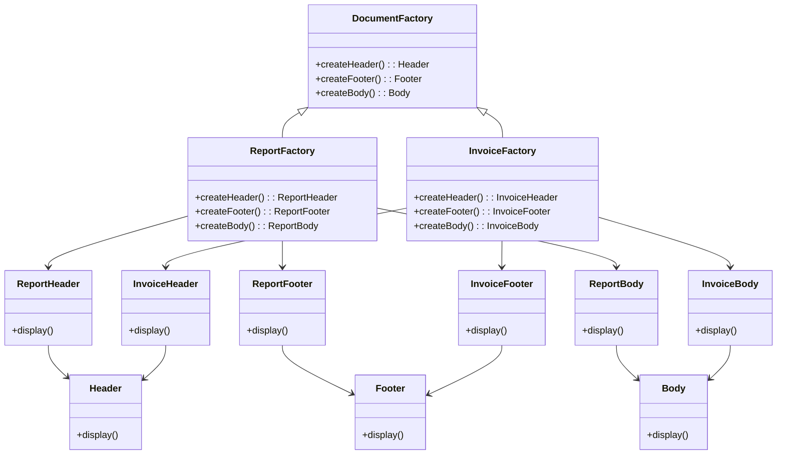

# What is the Abstract Factory Pattern?
Is a creational design pattern that provides an interface for creating families of related or dependent objects without specifying their concrete classes. Unlike the Factory Method, which allows for the creation of a single type of object, the Abstract Factory defines an interface for creating multiple related objects. The goal of this pattern is to provide a way to create families of related objects without tying the client to specific classes.
Is typically used when the system needs to be independent of how its products are created, composed, and represented.

# Key Concepts:
    - **Abstract Factory Interface**: Defines a set of methods for creating related products or families of objects.
    - **Concrete Factories**: Implement the abstract factory interface to produce specific sets of related objects.
    - **Products**: The different types of objects that the factories create, usually grouped into families or categories.
    - **Promotes consistency**: Ensures that the objects created by the factory are compatible with each other and follow a particular structure.

# Problem
Imagine you have an application that needs to create different types of documents, such as reports, invoices, and letters. Each of these document types may require different resources, such as headers, footers, and layouts, and you need a way to create these resources dynamically without tightly coupling your code to specific document types.
Using an Abstract Factory pattern, you can create an interface for creating related resources, ensuring that all parts of the document are consistent and fit together without manually specifying each one.

# Solution
You can define an Abstract Factory that produces families of related objects. In this case, different types of documents (reports, invoices, etc.) need their respective sets of resources (headers, footers, etc.). Concrete factories will implement the abstract factory to produce the correct type of resources for each document type.

```java

// Abstract Product interfaces
public interface Header {
    void display();
}

public interface Footer {
    void display();
}

public interface Body {
    void display();
}

// Abstract Factory interface
public interface DocumentFactory {
    Header createHeader();
    Footer createFooter();
    Body createBody();
}

// Concrete Products for Report
public class ReportHeader implements Header {
    public void display() {
        System.out.println("Displaying Report Header.");
    }
}

public class ReportFooter implements Footer {
    public void display() {
        System.out.println("Displaying Report Footer.");
    }
}

public class ReportBody implements Body {
    public void display() {
        System.out.println("Displaying Report Body.");
    }
}

// Concrete Products for Invoice
public class InvoiceHeader implements Header {
    public void display() {
        System.out.println("Displaying Invoice Header.");
    }
}

public class InvoiceFooter implements Footer {
    public void display() {
        System.out.println("Displaying Invoice Footer.");
    }
}

public class InvoiceBody implements Body {
    public void display() {
        System.out.println("Displaying Invoice Body.");
    }
}

// Concrete Factories
public class ReportFactory implements DocumentFactory {
    public Header createHeader() {
        return new ReportHeader();
    }

    public Footer createFooter() {
        return new ReportFooter();
    }

    public Body createBody() {
        return new ReportBody();
    }
}

public class InvoiceFactory implements DocumentFactory {
    public Header createHeader() {
        return new InvoiceHeader();
    }

    public Footer createFooter() {
        return new InvoiceFooter();
    }

    public Body createBody() {
        return new InvoiceBody();
    }
}
```

Client Code
The client now interacts with the Abstract Factory and can create documents (reports, invoices) without knowing the exact classes being used.

```java

public class Client {
    public static void main(String[] args) {
        // Client chooses the factory based on the type of document
        DocumentFactory reportFactory = new ReportFactory();
        DocumentFactory invoiceFactory = new InvoiceFactory();

        // Create a Report document
        Header reportHeader = reportFactory.createHeader();
        Footer reportFooter = reportFactory.createFooter();
        Body reportBody = reportFactory.createBody();

        reportHeader.display(); // Output: Displaying Report Header.
        reportFooter.display(); // Output: Displaying Report Footer.
        reportBody.display();   // Output: Displaying Report Body.

        // Create an Invoice document
        Header invoiceHeader = invoiceFactory.createHeader();
        Footer invoiceFooter = invoiceFactory.createFooter();
        Body invoiceBody = invoiceFactory.createBody();

        invoiceHeader.display(); // Output: Displaying Invoice Header.
        invoiceFooter.display(); // Output: Displaying Invoice Footer.
        invoiceBody.display();   // Output: Displaying Invoice Body.
    }
}
```

# Diagram



# FAQ

## Why use the Abstract Factory Pattern?
    - **Encapsulation of object creation:** 
        The Abstract Factory pattern provides a way to delegate the responsibility of creating objects to subclasses, allowing you to abstract away the details of object creation.
    - **Consistency of related products:** 
        It ensures that objects that belong to the same family are used together, avoiding incompatible configurations.
    - **Promotes flexibility:**
         The pattern allows for easy expansion. New families of products can be added without changing the client code, adhering to the open/closed principle.

## What are the benefits of using the Abstract Factory pattern?
    - Decouples product creation: It separates the creation of products from the client code, ensuring that clients don’t need to know the exact types of objects they are using.
    - Supports the Open/Closed Principle: You can add new product families (e.g., new document types) without modifying the existing client code.
    - Ensures consistency: The Abstract Factory ensures that related products are compatible, preventing clients from using mismatched objects.

## What are the disadvantages of using the Abstract Factory pattern?
    - Increased complexity: 
        The pattern introduces multiple interfaces and classes, making the system more complex.
    - Difficult to implement in small systems: 
        If your system is simple and doesn’t require a lot of product families, using an abstract factory may feel over-engineered.

## How does the Abstract Factory affect SOLID principles?
    - Single Responsibility Principle (**SRP**): Each concrete factory is responsible for creating a family of related objects, adhering to SRP.
    - Open/Closed Principle (**OCP**): The pattern allows for new product families to be added without changing the existing codebase.
    - Liskov Substitution Principle (**LSP**): Any subclass of the factory can be used in place of the base class without affecting the client code.
    - Interface Segregation Principle (**ISP**): The pattern enables defining smaller, focused interfaces for specific products, adhering to ISP.
    - Dependency Inversion Principle (**DIP**): High-level modules depend on abstractions (the Abstract Factory interface), not concrete implementations.

## How easy is it to test the Abstract Factory pattern?
    
Testing is straightforward because you can mock or stub the Abstract Factory and its concrete factories in unit tests. This decouples the client code from the concrete factory implementation, making the system easier to test.

## How can I test the Abstract Factory pattern?

You can **mock** the factory to test the interaction between the **client** and the **created objects**.

Example:

```java
public class DocumentFactoryTest {
    @Test
    public void testReportDocumentCreation() {
        DocumentFactory factory = new ReportFactory();
        Header header = factory.createHeader();
        Footer footer = factory.createFooter();
        Body body = factory.createBody();

        assertTrue(header instanceof ReportHeader);
        assertTrue(footer instanceof ReportFooter);
        assertTrue(body instanceof ReportBody);
    }

    @Test
    public void testInvoiceDocumentCreation() {
        DocumentFactory factory = new InvoiceFactory();
        Header header = factory.createHeader();
        Footer footer = factory.createFooter();
        Body body = factory.createBody();

        assertTrue(header instanceof InvoiceHeader);
        assertTrue(footer instanceof InvoiceFooter);
        assertTrue(body instanceof InvoiceBody);
    }
}
```