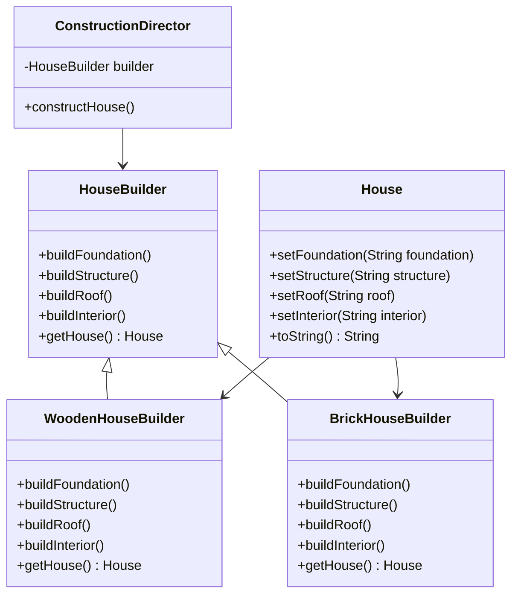

# Builder Pattern
Allowing you to create different types and representations of an object using the same construction process, separates the construction of a complex object from its representation. 

# Key Concepts:
    - **Builder Interface:** Declares the methods to build different parts of the object.
    - **Concrete Builder:** Implements the Builder interface to construct and assemble the parts of the product.
    - **Director:** Directs the construction process by interacting with the builder.
    - **Product:** The complex object being constructed.

# Problem
Suppose you are building a system for constructing various types of houses (e.g., wood houses, brick houses, glass houses). Each type of house has a different configuration but shares a similar construction process. 
How do you design a system that allows for flexible creation of different house types without hardcoding the logic for each configuration?

# Solution
The Builder Pattern lets you encapsulate the construction process in a Builder and control the process using a Director. This decouples the construction logic from the representation of the final product.

## Builder Interface

```java
public interface HouseBuilder {
    void buildFoundation();
    void buildStructure();
    void buildRoof();
    void buildInterior();
    House getHouse();
}
```

## Concrete Builders
```java
public class WoodenHouseBuilder implements HouseBuilder {
    private House house;

    public WoodenHouseBuilder() {
        this.house = new House();
    }

    @Override
    public void buildFoundation() {
        house.setFoundation("Wooden Piles");
    }

    @Override
    public void buildStructure() {
        house.setStructure("Wood and Bamboo");
    }

    @Override
    public void buildRoof() {
        house.setRoof("Wooden Shingles");
    }

    @Override
    public void buildInterior() {
        house.setInterior("Wooden Panels");
    }

    @Override
    public House getHouse() {
        return this.house;
    }
}

public class BrickHouseBuilder implements HouseBuilder {
    private House house;

    public BrickHouseBuilder() {
        this.house = new House();
    }

    @Override
    public void buildFoundation() {
        house.setFoundation("Concrete and Steel");
    }

    @Override
    public void buildStructure() {
        house.setStructure("Brick and Mortar");
    }

    @Override
    public void buildRoof() {
        house.setRoof("Concrete Slabs");
    }

    @Override
    public void buildInterior() {
        house.setInterior("Plastered Walls");
    }

    @Override
    public House getHouse() {
        return this.house;
    }
}
```

## Product
```java
public class House {
    private String foundation;
    private String structure;
    private String roof;
    private String interior;

    // Getters and Setters
    public void setFoundation(String foundation) {
        this.foundation = foundation;
    }

    public void setStructure(String structure) {
        this.structure = structure;
    }

    public void setRoof(String roof) {
        this.roof = roof;
    }

    public void setInterior(String interior) {
        this.interior = interior;
    }

    @Override
    public String toString() {
        return "House built with " +
                "foundation='" + foundation + '\'' +
                ", structure='" + structure + '\'' +
                ", roof='" + roof + '\'' +
                ", interior='" + interior + '\'';
    }
}
```

## Director
```java
public class ConstructionDirector {
    private HouseBuilder builder;

    public ConstructionDirector(HouseBuilder builder) {
        this.builder = builder;
    }

    public void constructHouse() {
        builder.buildFoundation();
        builder.buildStructure();
        builder.buildRoof();
        builder.buildInterior();
    }
}
```

## Client Code
```java
public class BuilderPatternDemo {
    public static void main(String[] args) {
        // Construct a Wooden House
        HouseBuilder woodenBuilder = new WoodenHouseBuilder();
        ConstructionDirector director = new ConstructionDirector(woodenBuilder);
        director.constructHouse();
        House woodenHouse = woodenBuilder.getHouse();
        System.out.println("Wooden House:\n" + woodenHouse);

        // Construct a Brick House
        HouseBuilder brickBuilder = new BrickHouseBuilder();
        director = new ConstructionDirector(brickBuilder);
        director.constructHouse();
        House brickHouse = brickBuilder.getHouse();
        System.out.println("\nBrick House:\n" + brickHouse);
    }
}
```

Diagram


# FAQ

## Why use the Builder Pattern?
    - **Encapsulation of construction:** The Builder Pattern encapsulates the construction logic of complex objects.
    - **Promotes flexibility:** Allows different builders to create variations of a product without changing the client code.
    - **Step-by-step construction:** Enables incremental and controlled assembly of complex objects.

## What are the benefits of using the Builder Pattern?
    - **Improves readability:** Separates object construction from representation, making the code more modular.
    - **Reusable builders:** Builders can be reused across different products, reducing redundancy.
    - **Supports Open/Closed Principle:** You can add new builders without modifying the client code.

## What are the disadvantages of using the Builder Pattern?
    - **Increased complexity:** Introduces additional classes and interfaces, which may feel excessive for simple objects.
    - **Overhead for small objects:** Not ideal for constructing simple objects with few attributes.

## How does the Builder Pattern affect SOLID principles?
    - Single Responsibility Principle **(SRP)**: Each builder is responsible for constructing a specific type of object.
    - Open/Closed Principle **(OCP)**: New builders can be added without modifying existing code.
    - Liskov Substitution Principle **(LSP)**: Any builder subclass can be used by the director without affecting the functionality.
    - Interface Segregation Principle **(ISP)**: Builders define focused methods for constructing parts of the product.
    - Dependency Inversion Principle **(DIP)**: The director depends on abstractions (builders), not concrete implementations.

## How easy is it to test the Builder Pattern?
Testing is straightforward as you can independently test each builder’s methods and the director’s coordination logic.

## How can I test the Builder Pattern?

```java
public class BuilderPatternTest {
    @Test
    public void testWoodenHouseBuilder() {
        HouseBuilder builder = new WoodenHouseBuilder();
        builder.buildFoundation();
        builder.buildStructure();
        builder.buildRoof();
        builder.buildInterior();

        House house = builder.getHouse();
        assertEquals("Wooden Piles", house.getFoundation());
        assertEquals("Wood and Bamboo", house.getStructure());
    }

    @Test
    public void testDirectorWithBrickBuilder() {
        HouseBuilder builder = new BrickHouseBuilder();
        ConstructionDirector director = new ConstructionDirector(builder);
        director.constructHouse();

        House house = builder.getHouse();
        assertEquals("Concrete and Steel", house.getFoundation());
        assertEquals("Brick and Mortar", house.getStructure());
    }
}
```