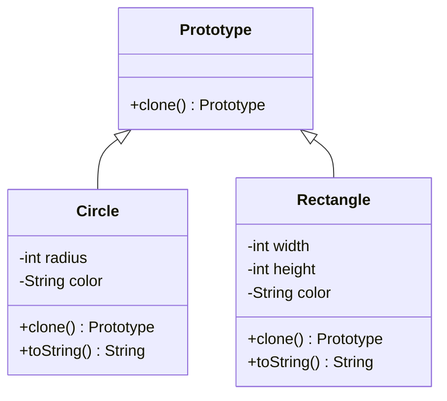

# Prototype Pattern

Provides a mechanism to copy or clone objects, creating new instances by duplicating existing ones.

# Key Concepts
    - **Prototype Interface:** Declares the cloning method.
    - **Concrete Prototypes:** Implements the prototype interface and defines the actual method for cloning.
    - **Client:** Uses the prototype interface to clone objects.

# Problem
Suppose you are designing a graphic editor where users can add shapes (e.g., circles, rectangles) with various properties (color, size, etc.). Cloning an existing shape would be easier than recreating a similar one from scratch each time.
How can you achieve this efficiently and flexibly without tightly coupling the client to specific classes?

# Solution
Using the Prototype Pattern, you create a common interface for cloning objects, allowing the client to duplicate objects dynamically at runtime.

**Prototype Interface**

```java
public interface Prototype {
    Prototype clone();
}
```

**Concrete Prototypes**

```java
public class Circle implements Prototype {
    private int radius;
    private String color;

    public Circle(int radius, String color) {
        this.radius = radius;
        this.color = color;
    }

    // Getters and Setters
    public void setRadius(int radius) {
        this.radius = radius;
    }

    public void setColor(String color) {
        this.color = color;
    }

    @Override
    public Prototype clone() {
        // Deep copy for immutability
        return new Circle(this.radius, this.color);
    }

    @Override
    public String toString() {
        return "Circle [radius=" + radius + ", color=" + color + "]";
    }
}

public class Rectangle implements Prototype {
    private int width;
    private int height;
    private String color;

    public Rectangle(int width, int height, String color) {
        this.width = width;
        this.height = height;
        this.color = color;
    }

    // Getters and Setters
    public void setWidth(int width) {
        this.width = width;
    }

    public void setHeight(int height) {
        this.height = height;
    }

    public void setColor(String color) {
        this.color = color;
    }

    @Override
    public Prototype clone() {
        // Deep copy for immutability
        return new Rectangle(this.width, this.height, this.color);
    }

    @Override
    public String toString() {
        return "Rectangle [width=" + width + ", height=" + height + ", color=" + color + "]";
    }
}
```

**Client Code**

```java
public class PrototypePatternDemo {
    public static void main(String[] args) {
        // Original objects
        Circle originalCircle = new Circle(10, "Red");
        Rectangle originalRectangle = new Rectangle(20, 30, "Blue");

        // Clone objects
        Circle clonedCircle = (Circle) originalCircle.clone();
        Rectangle clonedRectangle = (Rectangle) originalRectangle.clone();

        // Modify cloned objects
        clonedCircle.setColor("Green");
        clonedRectangle.setHeight(40);

        // Print original and cloned objects
        System.out.println("Original Circle: " + originalCircle);
        System.out.println("Cloned Circle: " + clonedCircle);

        System.out.println("Original Rectangle: " + originalRectangle);
        System.out.println("Cloned Rectangle: " + clonedRectangle);
    }
}
```

# Diagram



# FAQ

## Why use the Prototype Pattern?
  - To avoid the overhead of creating complex objects.
  - To provide a mechanism for cloning objects with slight variations.
  - To ensure consistency when duplicating objects with intricate internal states.

## Benefits
  - **Efficient Object Creation:** Reduces the cost of creating objects from scratch.
  - **Flexibility:** Allows for easy modification of cloned objects without affecting the original.
  - **Supports Open/Closed Principle:** Adding new prototypes doesn’t require modifying the client code.

## Drawbacks
  - **Shallow Copy Issues:** By default, cloning may result in shallow copies, which can lead to unintended side effects.
  - **Increased Complexity:** Requires careful implementation for deep copies when objects have complex references.

## How does it align with SOLID principles?
  - **Single Responsibility Principle:** Each prototype is responsible for its cloning logic.
  - **Open/Closed Principle:** New prototype types can be added without altering existing code.
  - **Liskov Substitution Principle:** Any prototype can be cloned and used interchangeably.

# Testing

```java
import org.junit.Test;
import static org.junit.Assert.*;

public class PrototypePatternTest {
    @Test
    public void testCircleClone() {
        Circle original = new Circle(10, "Red");
        Circle clone = (Circle) original.clone();

        assertNotSame(original, clone); // Ensure the objects are different
        assertEquals(original.toString(), clone.toString()); // Ensure the properties are copied
    }

    @Test
    public void testRectangleClone() {
        Rectangle original = new Rectangle(20, 30, "Blue");
        Rectangle clone = (Rectangle) original.clone();

        assertNotSame(original, clone);
        assertEquals(original.toString(), clone.toString());

        // Modify the clone
        clone.setColor("Green");
        assertNotEquals(original.toString(), clone.toString()); // Ensure modifications do not affect original
    }
}
```