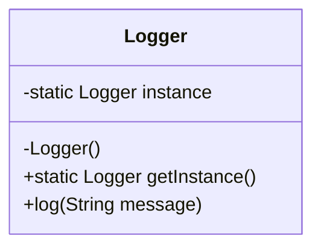

# Singleton Pattern
The Singleton Pattern restricts the instantiation of a class to a single instance and provides a way to access it globally.

# Key Concepts
  - **Private Constructor:** Ensures that the class cannot be instantiated directly.
  - **Static Instance:** A single, shared instance of the class is stored as a static member.
  - **Public Access Method:** Provides a global access point to the instance.

# Problem
Suppose you are designing a logging system where all components in the application need access to the same logger instance.
How do you ensure that only one logger instance exists and is shared across all components?

# Solution
Using the Singleton Pattern, you create a single, shared instance of the logger that is accessible globally.

```java
public class Logger {
    // Static member to hold the single instance
    private static Logger instance;

    // Private constructor to prevent instantiation
    private Logger() {
        // Initialize the logger
        System.out.println("Logger initialized.");
    }

    // Public method to provide access to the instance
    public static Logger getInstance() {
        if (instance == null) {
            synchronized (Logger.class) {
                if (instance == null) { // Double-checked locking
                    instance = new Logger();
                }
            }
        }
        return instance;
    }

    // Method to log a message
    public void log(String message) {
        System.out.println("Log: " + message);
    }
}
```

**Client Code**

```java

public class SingletonPatternDemo {
    public static void main(String[] args) {
        // Get the single instance of Logger
        Logger logger1 = Logger.getInstance();
        Logger logger2 = Logger.getInstance();

        // Log messages
        logger1.log("This is the first log message.");
        logger2.log("This is the second log message.");

        // Verify both references point to the same instance
        System.out.println("Logger1 and Logger2 are the same instance: " + (logger1 == logger2));
    }
}
```

# Diagram



# FAQ

## Why use the Singleton Pattern?
  - To control access to shared resources.
  - To ensure consistent behavior by using a single instance globally.
  - To reduce memory usage and initialization overhead.

## Benefits
  - **Controlled Access:** Ensures that only one instance exists.
  - **Reduced Overhead:** Avoids repeated initialization of shared resources.
  - **Global Access:** Provides a centralized point of access to the instance.

## Drawbacks

  - **Global State Issues:** Can make testing and debugging harder if the singleton is mutable.
  - **Concurrency:** Must handle multi-threaded access carefully to avoid creating multiple instances.

## How does it align with SOLID principles?
  - **Single Responsibility Principle:** Ensures a single, global instance with controlled access.
  - **Violation of Dependency Injection:** Makes dependency injection harder since it requires the singleton instance.

## Testing

```java
import org.junit.Test;
import static org.junit.Assert.*;

public class SingletonPatternTest {
    @Test
    public void testSingletonInstance() {
        Logger logger1 = Logger.getInstance();
        Logger logger2 = Logger.getInstance();

        assertSame(logger1, logger2); // Ensure both references point to the same instance
    }

    @Test
    public void testLoggerFunctionality() {
        Logger logger = Logger.getInstance();
        logger.log("Test log message.");

        // Verify output manually if needed (not part of automated test)
    }
}
```