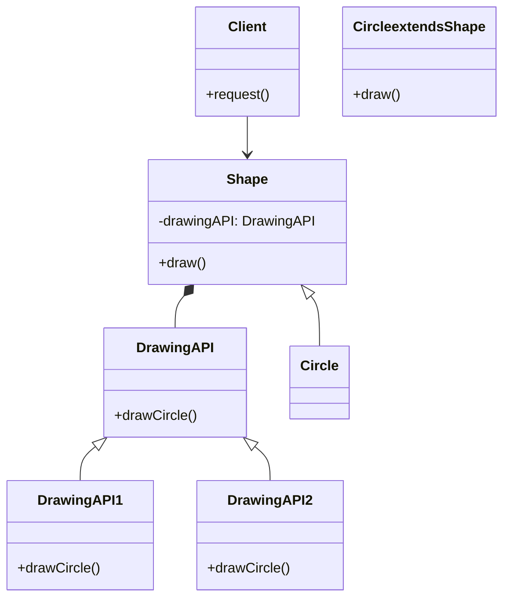

# What is bridge pattern ?
- The bridge pattern is a structural design pattern that decouples an abstraction from its implementation so that the two can vary independently.
    Is used to:
    - Avoid a permanent binding between an abstraction and its implementation.
    - Share an implementation among multiple objects.
    - Hide implementation details from clients.
    - Change the implementation of an abstraction at runtime.
    - Extend an abstraction without changing its implementation.
    - Create a platform-independent abstraction.

# Example

# Problem 
Suppose we have a `Shape` class that provides a method to draw a shape. We want to use this class in our application, but the method provided by the class does not match the interface required by the client.

```java
public abstract class Shape {
    public abstract void draw();
}
```

# Solution
We can use the bridge pattern to change the interface of the `Shape` class to match the interface required by the client. We can create an interface that represents the implementation of the `Shape` class and an abstract class that represents the abstraction of the `Shape` class.

```java
public interface DrawingAPI {
    void drawCircle(double x, double y, double radius);
}

public class DrawingAPI1 implements DrawingAPI {
    @Override
    public void drawCircle(double x, double y, double radius) {
        System.out.printf("API1.circle at %f:%f radius %f\n", x, y, radius);
    }
}

public class DrawingAPI2 implements DrawingAPI {
    @Override
    public void drawCircle(double x, double y, double radius) {
        System.out.printf("API2.circle at %f:%f radius %f\n", x, y, radius);
    }
}

public abstract class Shape {
    protected DrawingAPI drawingAPI;

    protected Shape(DrawingAPI drawingAPI) {
        this.drawingAPI = drawingAPI;
    }

    public abstract void draw();
}

```

# Diagram


# FAQ

# Why use bridge pattern?
- The bridge pattern is used to decouple an abstraction from its implementation so that the two can vary independently. This allows the implementation of an abstraction to be changed at runtime without affecting the client code. The bridge pattern is useful when you want to hide implementation details from clients, share an implementation among multiple objects, or create a platform-independent abstraction.

# Which abstract examples we can use to understand bridge pattern?
- The example of a shape drawing application is a good way to understand the bridge pattern. In this example, the `Shape` class represents the abstraction, and the `DrawingAPI` interface represents the implementation. By using the bridge pattern, we can change the implementation of the `Shape` class without affecting the client code.

# What are the benefits of using the bridge pattern?
- The bridge pattern allows you to change the implementation of an abstraction at runtime without affecting the client code.
- The bridge pattern allows you to share an implementation among multiple objects, reducing code duplication.
- The bridge pattern allows you to hide implementation details from clients, making it easier to understand and work with the code.
- The bridge pattern allows you to create a platform-independent abstraction, making it easier to port the code to different platforms.

# What are the negative aspects of using the bridge pattern?
- The bridge pattern can introduce additional complexity to the code, as it requires the creation of multiple classes and interfaces.
- The bridge pattern can make the code harder to understand, as it separates the abstraction from its implementation.
- The bridge pattern can make the code harder to maintain, as it requires changes to both the abstraction and the implementation when the implementation changes.

# How can the bridge pattern affect SOLID principles?
- The bridge pattern can help you adhere to the Single Responsibility Principle by separating the abstraction from its implementation. 
This allows you to change the implementation of an abstraction without affecting the client code.

# How easy is to test bridge pattern?
- The bridge pattern makes it easier to test the client code because it decouples the client code from the implementation details. 
You can create mock objects for the implementation classes and test the client code independently of the implementation classes.