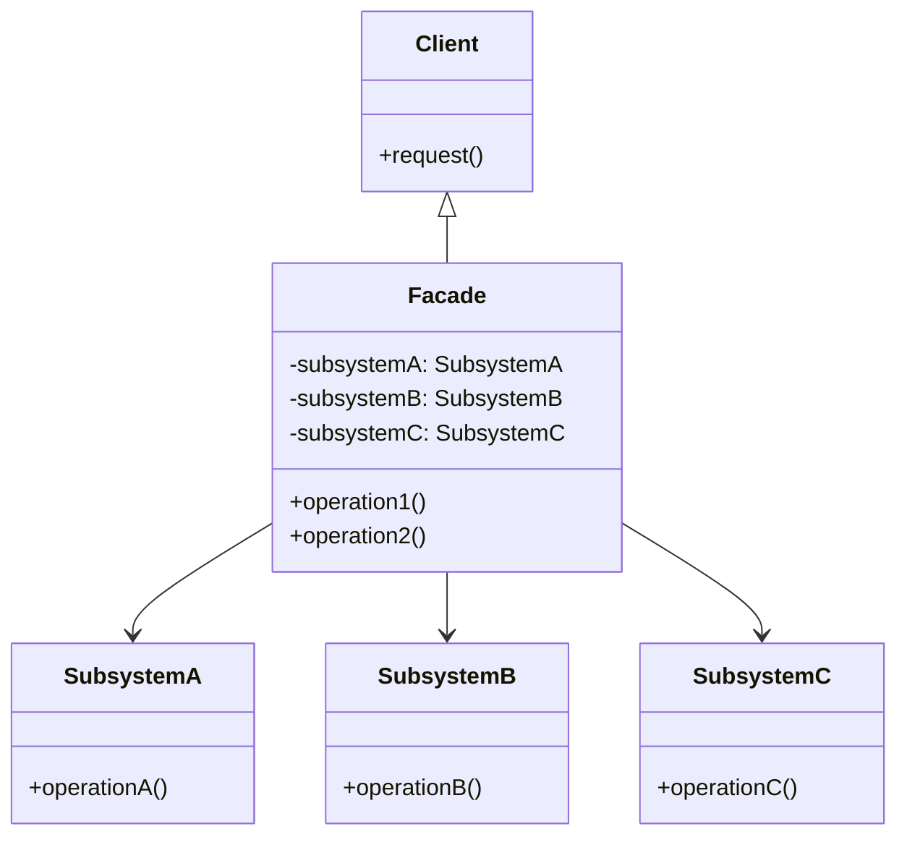

# Facade Pattern

## What is Facade Pattern?

Facade is a structural design pattern that provides a simplified interface to a library, a framework, or any other complex set of classes.

## Example:

### Problem

Suppose we have a complex system with multiple classes that provide different functionalities. We want to use this system in our application, but dealing with all the classes directly can be cumbersome and error-prone.

```java
public class SubsystemA {
    public void operationA() {
        System.out.println("Subsystem A: operation A");
    }
}

public class SubsystemB {
    public void operationB() {
        System.out.println("Subsystem B: operation B");
    }
}

public class SubsystemC {
    public void operationC() {
        System.out.println("Subsystem C: operation C");
    }
}
```

### Solution

We can use the facade pattern to create a facade class that provides a simplified interface to the complex system. The facade class encapsulates the interactions with the subsystem classes and provides a single entry point for the client.

```java

public class Facade {

    private SubsystemA subsystemA;
    private SubsystemB subsystemB;
    private SubsystemC subsystemC;

    public Facade() {
        this.subsystemA = new SubsystemA();
        this.subsystemB = new SubsystemB();
        this.subsystemC = new SubsystemC();
    }

    public void operation1() {
        System.out.println("Facade: operation 1");
        subsystemA.operationA();
        subsystemB.operationB();
    }

    public void operation2() {
        System.out.println("Facade: operation 2");
        subsystemB.operationB();
        subsystemC.operationC();
    }
}

```


### Diagram




# FAQ

## When to use the Facade pattern?
When you want to:
- Provide a simple interface to a complex system.
- Decouple the client code from the subsystem classes.
- Reduce dependencies between the client and the subsystem classes.
- Organize a subsystem into layers.

## What are the benefits of using the Facade pattern?

- Simplifies the client code by providing a single entry point to the subsystem.
- Decouples the client code from the subsystem classes, making it easier to change or replace the subsystem.
- Reduces dependencies between the client and the subsystem classes, improving maintainability and testability.
- Organizes a subsystem into layers, making it easier to understand and work with.

## What are the negative aspects of using the Facade pattern?

- May introduce an additional layer of abstraction, which can make the code more complex.
- May hide important details of the subsystem, making it harder to understand how the system works.
- May lead to a bloated facade class that tries to do too much, violating the single responsibility principle.

## How easy is to test facade pattern?

The facade pattern makes it easier to test the client code because it decouples the client code from the subsystem classes.
You can create mock objects for the subsystem classes and test the client code independently of the subsystem classes.

## What are some real-world examples of the facade pattern?

- A computer's power button acts as a facade for the complex system of hardware components inside the computer.
- A remote control for a TV acts as a facade for the complex system of buttons and settings on the TV.
- A software library that provides a simplified interface to a complex set of classes or functions.

## How does the facade pattern differ from other design patterns?

- The facade pattern is similar to the adapter pattern, but the facade pattern provides a simplified interface to a complex system, while the adapter pattern provides a compatible interface to an incompatible system.


