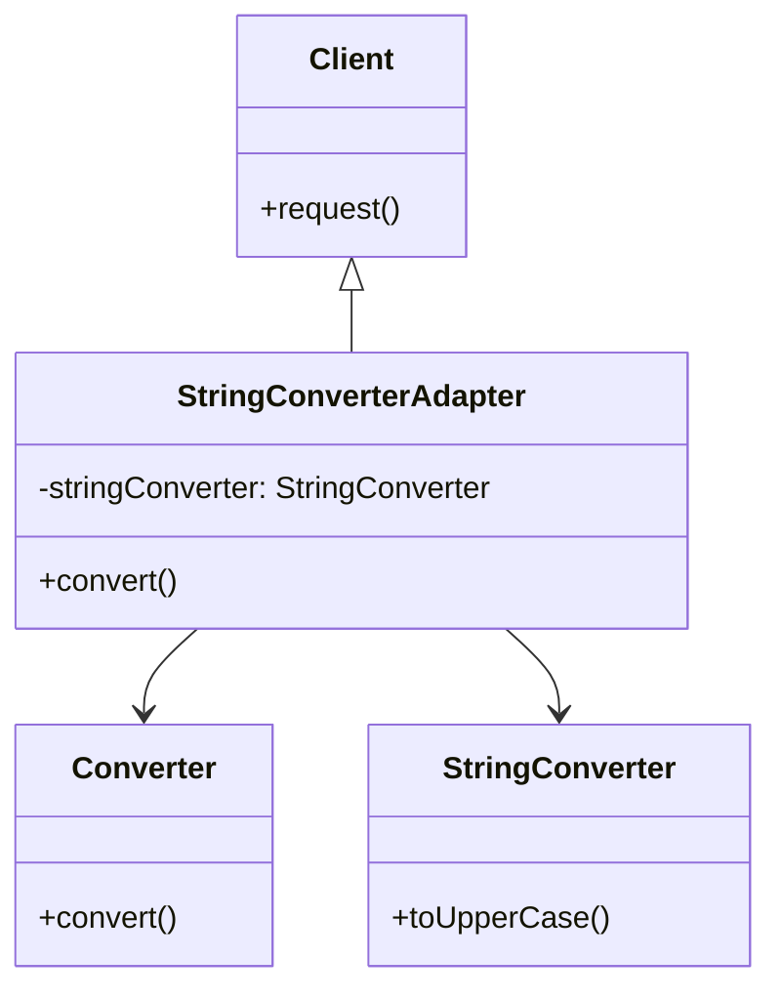

# What is adapter pattern ?

Adapter pattern is a structural pattern that allows objects with incompatible interfaces to work together. It is used to change the interface of an existing class to match the interface required by the client.

# Example:

 ## Problem

Suppose we have a class that provides a method to convert a string to uppercase. We want to use this class in our application, but the method provided by the class does not match the interface required by the client.

```java
public class StringConverter {
    public String toUpperCase(String str) {
        return str.toUpperCase();
    }
}
```

 ## Solution

We can use the adapter pattern to change the interface of the `StringConverter` class to match the interface required by the client. We can create an adapter class that implements the required interface and delegates the call to the `StringConverter` class.

```java
public interface Converter {
    String convert(String str);
}

public class StringConverterAdapter implements Converter {
    private StringConverter stringConverter;

    public StringConverterAdapter(StringConverter stringConverter) {
        this.stringConverter = stringConverter;
    }

    @Override
    public String convert(String str) {
        return stringConverter.toUpperCase(str);
    }
}
```


 ## Diagram



<TabViews>


# FAQ
 
 ## Why use adapter ?
 - When you want to use an existing class, and its interface does not match the one you need.

## Which abstract examples we can use to understand adapter pattern?
- The example of a power adapter is a good way to understand the adapter pattern.
- The example of a USB to Ethernet adapter is a good way to understand the adapter pattern.

##  What are the benefits of using the adapter pattern?
- It allows objects with incompatible interfaces to work together.
- It allows you to change the interface of an existing class to match the interface required by the client.
- It allows you to reuse existing code without modifying it.
- It allows you to decouple the client code from the implementation details of the adapter.

##  What are the negative aspects of using the adapter pattern?
- It can make the code more complex by introducing additional classes.
- It can make the code harder to understand by hiding the implementation details of the adapter.
- It can make the code harder to maintain by introducing an additional layer of abstraction.

## How can the adapter affect SOLID principles?
- The adapter pattern can help you follow the Single Responsibility Principle by separating the client code from the implementation details of the adapter.

## How easy is to test adapter pattern?
- The adapter pattern makes it easier to test the client code because it decouples the client code from the implementation details of the adapter.

# How to test adapter pattern?

- You can test the adapter pattern by creating a client class that uses the adapter to convert a string to uppercase.
- You can create a mock object of the `StringConverter` class and pass it to the adapter class to test the adapter pattern.
