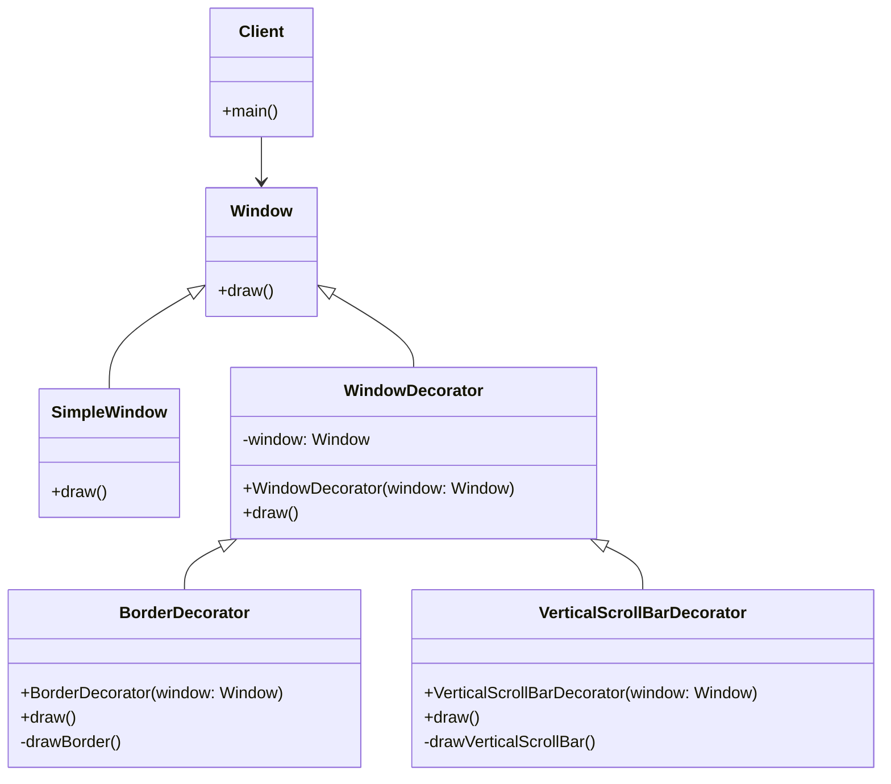

# What is decorator pattern ?

The decorator pattern is a structural design pattern that allows adding new behaviors to objects dynamically by placing them inside special wrapper objects called decorators.

# Example

## Problem

Suppose we have a `Window` interface that provides a method to draw a window. We want to use this interface in our application, but the method provided by the interface does not match the interface required by the client.

```java
public interface Window {
    void draw();
}
```

## Solution

We can use the decorator pattern to change the interface of the `Window` interface to match the interface required by the client. We can create a decorator class that implements the `Window` interface and delegates the method calls to the real `Window` object.

```java

public class SimpleWindow implements Window {
    @Override
    public void draw() {
        System.out.println("Drawing a simple window");
    }
}
```

```java
public class WindowDecorator implements Window {
    private Window window;

    public WindowDecorator(Window window) {
        this.window = window;
    }

    @Override
    public void draw() {
        window.draw();
    }
}
```

```java
public class BorderDecorator extends WindowDecorator {
    public BorderDecorator(Window window) {
        super(window);
    }

    @Override
    public void draw() {
        super.draw();
        drawBorder();
    }

    private void drawBorder() {
        System.out.println("Drawing a border");
    }
}
```

```java
public class VerticalScrollBarDecorator extends WindowDecorator {
    public VerticalScrollBarDecorator(Window window) {
        super(window);
    }

    @Override
    public void draw() {
        super.draw();
        drawVerticalScrollBar();
    }

    private void drawVerticalScrollBar() {
        System.out.println("Drawing a vertical scroll bar");
    }
}
```

## Usage

```java
public class Client {
    public static void main(String[] args) {
        Window window = new VerticalScrollBarDecorator(new BorderDecorator(new SimpleWindow()));
        window.draw();
    }
}
```

## Diagram



# Participants

The classes and objects participating in this pattern are:
- `Component` (Window)
  - defines the interface for objects that can have responsibilities added to them dynamically.
- `ConcreteComponent` (SimpleWindow)
  - defines an object to which additional responsibilities can be added.
- `Decorator` (WindowDecorator)
    - maintains a reference to a `Component` object and defines an interface that conforms to the interface of the `Component` interface.
- `ConcreteDecorator` (BorderDecorator, VerticalScrollBarDecorator)
    - adds responsibilities to the `Component` object.


# FAQ

## Why use decorator pattern?
- The decorator pattern is used to add new behaviors to objects dynamically without changing their interface. 
This allows you to extend the functionality of objects without modifying their code.

Use the decorator pattern when you want to:
- Add responsibilities to objects dynamically.
- Avoid subclassing to add functionality.
- Add functionality to an object without affecting other objects of the same class.

# Which abstract examples we can use to understand bridge pattern?
- The decorator pattern is used in many libraries and frameworks to add new features to existing classes.
- For example, the `java.io` package uses the decorator pattern to add new functionality to input and output streams.

# What are the benefits of using the decorator pattern?
Allows you to:
- Add new behaviors to objects dynamically without changing their interface.
- Extend the functionality of objects without modifying their code.
- Add functionality to an object without affecting other objects of the same class.

# What are the negative aspects of using the decorator pattern?

- The decorator pattern can lead to a large number of small classes if you have many decorators.
- It can be difficult to understand the interactions between decorators and the base object.
- It can be challenging to remove decorators from an object once they have been added.
- It can be hard to maintain the order of decorators when adding or removing them from an object.

# How can the decorator pattern affect SOLID principles?
The decorator pattern can help you follow the Open/Closed Principle by allowing you to add new functionality to objects without modifying their code. 
This can make your code more flexible and easier to maintain.

# How easy is to test decorator pattern?
The decorator pattern can be easy to test because each decorator can be tested independently of the other decorators and the base object.


