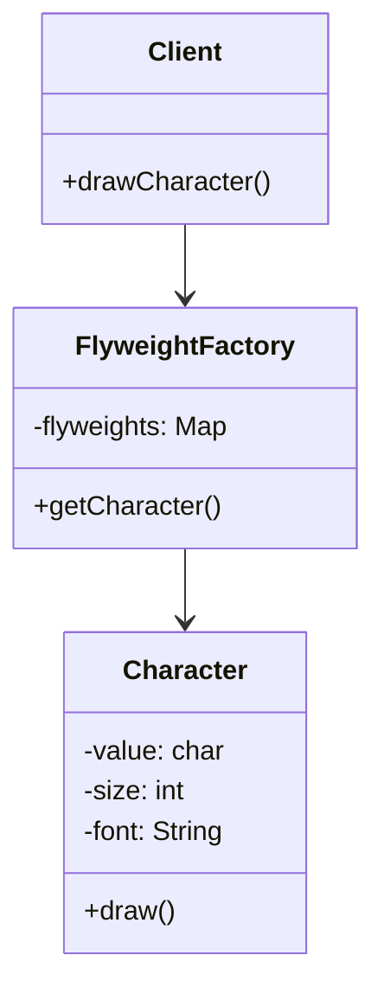

# What is flyweight pattern ?

Flyweight pattern is a structural pattern that allows sharing objects to be used in multiple contexts. 
It is used to reduce memory usage and improve performance by reusing objects that are the same.

## Example:

### Problem

Suppose we have a text editor application that allows users to create and edit documents.
The application has a large number of characters that need to be displayed on the screen.
Creating a separate object for each character can be memory-intensive and slow down the application.

```java
public class Character {
    private char value;
    private int size;
    private String font;
    
    public Character(char value, int size, String font) {
        this.value = value;
        this.size = size;
        this.font = font;
    }
    
    public void draw() {
        System.out.println("Drawing character: " + value + ", size: " + size + ", font: " + font);
    }
}
```

### Solution

We can use the flyweight pattern to create a flyweight factory that manages shared flyweight objects.
The flyweight factory creates and stores flyweight objects and provides a way to retrieve them based on the context.
The flyweight objects are shared among multiple contexts, reducing memory usage and improving performance.

```java
import java.util.HashMap;
import java.util.Map;

public class FlyweightFactory {
    private Map<Character, Character> flyweights = new HashMap<>();
    
    public Character getCharacter(char value, int size, String font) {
        Character character = new Character(value, size, font);
        if (!flyweights.containsKey(character)) {
            flyweights.put(character, character);
        }
        return flyweights.get(character);
    }
}
```

```java
public class Client {
    private FlyweightFactory factory = new FlyweightFactory();
    
    public void drawCharacter(char value, int size, String font) {
        Character character = factory.getCharacter(value, size, font);
        character.draw();
    }
}
```

## Diagram



# FAQ

# When to use flyweight pattern ?
- When you need to create a large number of objects that share common properties.
- When you want to reduce memory usage and improve performance by reusing objects. 
- When you want to separate the intrinsic and extrinsic state of an object.

# What are the key components of the flyweight pattern?
- Flyweight: Represents the shared flyweight objects that can be shared among multiple contexts.
- FlyweightFactory: Manages the creation and storage of flyweight objects.
- Client: Uses the flyweight objects to perform operations.

# What is the difference between intrinsic and extrinsic state in the flyweight pattern?
- Intrinsic state: Represents the properties of a flyweight object that can be shared among multiple contexts.
- Extrinsic state: Represents the properties of a flyweight object that are specific to a particular context.

# What are the advantages of using the flyweight pattern?
- Reduces memory usage by sharing objects.
- Improves performance by reusing objects.
- Separates intrinsic and extrinsic state of objects.
- Allows objects with shared properties to be used in multiple contexts.

# What are the disadvantages of using the flyweight pattern?
- Increases complexity by separating intrinsic and extrinsic state.
- Requires careful management of shared objects to avoid memory leaks.
- May reduce performance if not implemented correctly.

# What are some real-world examples of the flyweight pattern?
- Text editor applications that use shared font and style objects.
- Graphic design applications that use shared color and shape objects.
- Game development applications that use shared sprite and texture objects.

# How easy is to test flyweight pattern?
- The flyweight pattern is relatively easy to test because it separates the intrinsic and extrinsic state of objects.
- You can create mock objects for the flyweight objects and test the client code independently of the flyweight objects.

## How can the adapter affect SOLID principles?
- The adapter pattern can help you follow the Single Responsibility Principle by separating the client code from the implementation details of the adapter.