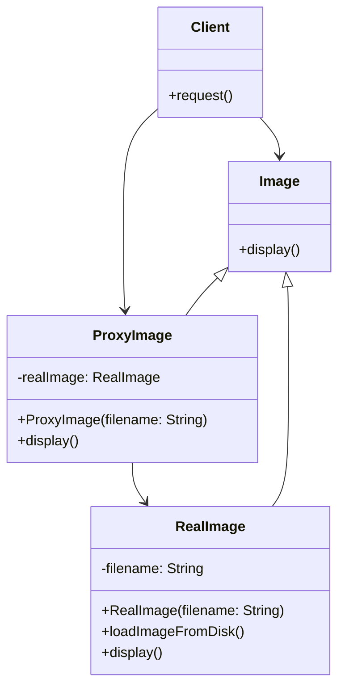

# What is Proxy Design Pattern?

Proxy Design Pattern is a structural design pattern that provides a surrogate or placeholder for another object to control access to it. It is used when we want to provide controlled access to an object. It is also known as the **Surrogate Design Pattern**.
The Proxy Design Pattern is a part of the Gang of Four (GoF) structural design patterns. It is used to create a representative object that controls access to another object, which may be remote, expensive to create, or in need of securing.


# Example

## Problem

Suppose we have a `Image` interface that provides a method to display an image. We want to use this interface in our application, but the method provided by the interface does not match the interface required by the client.

```java
public interface Image {
    void display();
}
```

## Solution

We can use the proxy pattern to change the interface of the `Image` interface to match the interface required by the client. We can create a proxy class that implements the `Image` interface and delegates the method calls to the real `Image` object.

```java
public class RealImage implements Image {
    private String filename;

    public RealImage(String filename) {
        this.filename = filename;
        loadImageFromDisk();
    }

    private void loadImageFromDisk() {
        System.out.println("Loading image " + filename);
    }

    @Override
    public void display() {
        System.out.println("Displaying image " + filename);
    }
}
```
    
    ```java

public class ProxyImage implements Image {
      //  Add code here
    
}
```

# Diagram


# Participants

The classes and objects participating in this pattern are:

- **Proxy** (`ProxyImage`)
  - maintains a reference that lets the proxy access the real subject.
  - provides an interface identical to `Image` so that a proxy can be substituted for the real subject.
  - controls access to the real subject and may be responsible for creating and deleting it.
  - other responsibilities depend on the kind of proxy:
    - **Remote Proxy** manages the connection to the real subject.
    - **Virtual Proxy** controls access to the real subject.
    - **Protection Proxy** controls access to the real subject.


- **Subject** (`Image`)
    - defines the common interface for `RealImage` and `ProxyImage` so that a `ProxyImage` can be used anywhere a `RealImage` is expected.


 # FAQ

# When to use the Proxy Design Pattern?
Use when you want to:
- Provide controlled access to an object.
- Add a level of indirection to an object.
- Defer the full cost of creating and initializing an object until it is actually needed.
- Hide the complexity of an object from the client.

# What are the different types of proxies?

There are several types of proxies, including:
- **Virtual Proxy**: A placeholder for an expensive-to-create object.
- **Remote Proxy**: Represents an object that is located on a different machine.
- **Protection Proxy**: Controls access to the real object based on the caller's permissions.
- **Cache Proxy**: Stores the results of expensive operations and returns the cached results when the same operation is requested again.

# What are the benefits of using the Proxy Design Pattern?

The Proxy Design Pattern offers several benefits, including:
- Controlled access to an object.
- Reduced memory usage and processing time by deferring the creation of an object until it is actually needed.
- Improved security by controlling access to the real object.
- Simplified client code by providing a simple interface to the client.

# What are the negative aspects of using the Proxy Design Pattern?

The Proxy Design Pattern can introduce additional complexity to the code, as it requires the creation of multiple classes and interfaces. 
It can also introduce performance overhead due to the additional method calls required to delegate requests to the real object.
Additionally, the Proxy Design Pattern can make the code harder to understand and maintain if not used appropriately.

# Real-world examples of Proxy Design Pattern

Some real-world examples of the Proxy Design Pattern include:
- A virtual proxy that loads images on demand rather than all at once.
- A protection proxy that restricts access to sensitive data based on user permissions.
- A remote proxy that communicates with a remote server to access data.

# How can the proxy pattern affect SOLID principles?

The Proxy Design Pattern can help adhere to the Single Responsibility Principle (SRP) by separating the concerns of controlling access to an object from the object itself. It can also help adhere to the Open/Closed Principle by allowing the behavior of the proxy to be extended without modifying the real subject or the client code. Additionally, the Proxy Design Pattern can help adhere to the Dependency Inversion Principle by allowing the client to depend on an abstraction (the `Image` interface) rather than a concrete implementation (the `RealImage` class).

# How easy is it to test the Proxy Design Pattern?

The Proxy Design Pattern can be relatively easy to test, as the proxy acts as a stand-in for the real subject and can be easily replaced with a mock object for testing purposes. 
By using a mock object, you can simulate different behaviors of the real subject and test how the client interacts with the proxy. 
Additionally, the Proxy Design Pattern can help improve testability by allowing you to isolate the client from the real subject and control access to the real subject during testing.


